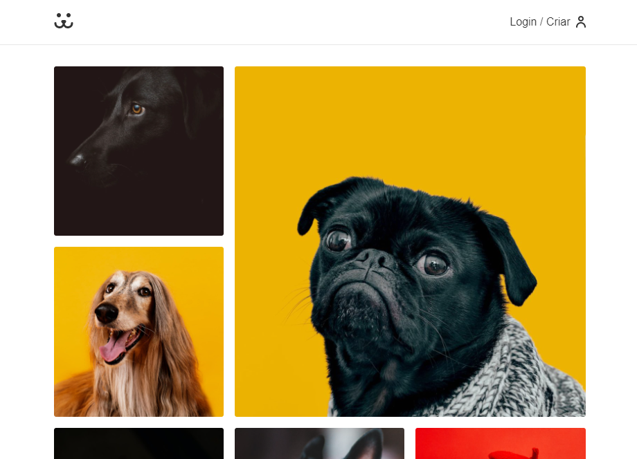

<h1 align='center'>Dogs</h1>
<h2 align='center'>Uma rede social para cachorros</h2>
<h3 align='center'>
  <a href="#tecnologias">Tecnologias</a> |
  <a href="#sobre">Sobre</a> |
  <a href="#pre-requisitos">Ver o projeto</a>
</h3>

# Tecnologias
Para a construção do projeto utilizei as seguintes tecnologias:
  <ul> 
    <li>HTML</li>
    <li>CSS</li>
    <li>JavaScript</li>
    <li>React</li>
    <li>React - Router</li>
    <li>Victory - Biblioteca de gráficos</li>
  </ul>

# Sobre

  O projeto se trata de uma rede social para cachorros. 

 Criado para o curso de React da <a target="_blank" href="https://www.origamid.com/">Origamid.</a>

## Funcionalidades

  - [X]Scroll infinito
  - [X]Login / cadastro
  - [X]Modal
  - [X]Consumo de Api
  - [X]Uso de biblioteca externa

# Veja o projeto aqui
## [Dogs](https://dogs.origamid.dev/)

## Pagina home

## Pagina login

## Pagina do usuário

#### Feito por Vitor para o curso de React 👍 | Veja meu [Linkedin](https://www.linkedin.com/in/vitor-lemos-1a61b3238/)
